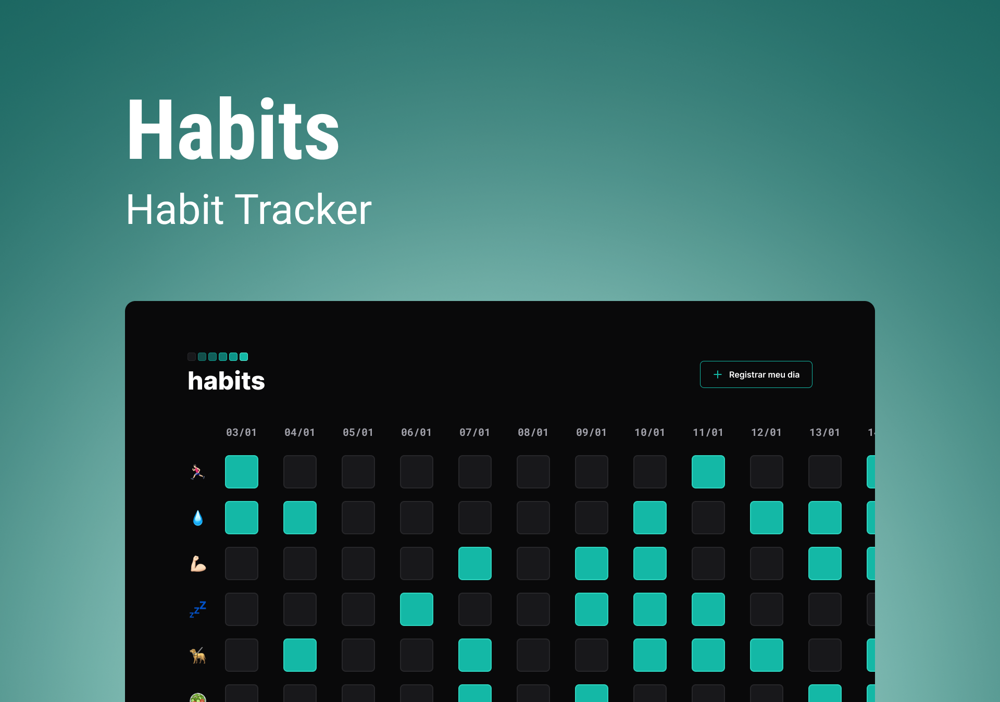

<h1 align="center"> Habits </h1>

Aplicação desenvolvida no 1º NLW de 2023 
NLW é um evento exclusivo e gratuito, promovido pela Rocketseat para ensino de tecnologias WEB 

  <a href="#-tecnologias">Tecnologias</a>&nbsp;&nbsp;&nbsp;|&nbsp;&nbsp;&nbsp;
  <a href="#-recursos">Recursos</a>&nbsp;&nbsp;&nbsp;|&nbsp;&nbsp;&nbsp;
  <a href="#-projeto">Projeto</a>&nbsp;&nbsp;&nbsp;|&nbsp;&nbsp;&nbsp;
  <a href="#-layout">Layout</a>&nbsp;&nbsp;&nbsp;|&nbsp;&nbsp;&nbsp;
  <a href="#-licença">Licença</a>

  

 

  

## 🚀 <u>Tecnologias</u>

Esse projeto foi desenvolvido com as seguintes tecnologias:

- HTML e CSS
- JavaScript
- Git e Github
- Figma

## 🛠 <u>Recursos</u>

Alguns recursos utilizados no projeto:

- Eventos
    - Click de mouse
    - Change em formulário

- Objetos
    - Date → to locale date

- Local Storage
    - setItem
    - getItem

- JSON stringify & Parse

- Uso de biblioteca

## 📝 <u>Projeto</u>

O Habits é uma aplicação para registrar e acompanhar os hábitos diários, por equanto ele salva os registros somente no local storage do navegador.

- [Acesse o projeto finalizado clicando neste link](https://martricker.github.io/habits/)

## 💻 <u>Layout</u>

Você pode visualizar o layout do projeto através [DESSE LINK](https://www.figma.com/file/zC2YpQRR2RxIqv3mhR0Ju6/Habits-(e)-(Community)?node-id=75%3A128&t=Z1d8JsB8KADsct5m-0). É necessário ter conta no [Figma](https://figma.com) para acessá-lo.

## © <u>Licença</u>

Esse projeto está sob a licença MIT

---

Feito com ♥ por Marlon Feilstricker